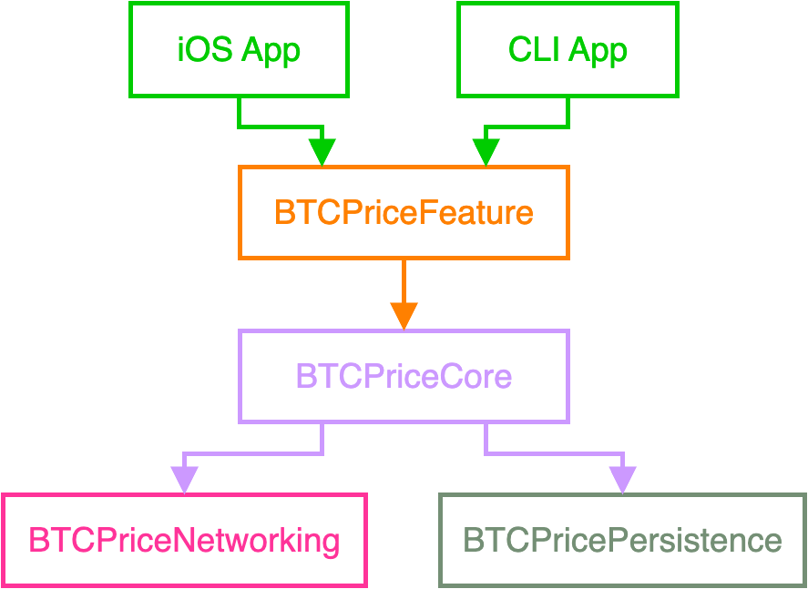

# BTC Price - Study Case

## Epic

```nocode
As a user
I want to see the BTC/USD price updated in real time (every second)
So I always know the latest value even if the network is flaky
```

## User Stories

### Story 1 - See price on iOS

```nocode
As an iOS user
I want to see the most recent BTC/USD price on screen
So I know the current value and when it was last updated
```

#### Acceptance Criteria

```nocode
Given I open the app
When the main screen appears
Then I see the price formatted as currency and the last-updated timestamp
And the view updates automatically every second
```

### Story 2 - See price on CLI

```nocode
As a console user
I want to see the most recent BTC/USD price printed every second
So I can monitor the value in real time from the terminal
```

#### Acceptance Criteria

```nocode
Given I run the CLI binary
When the program starts
Then it prints the price and timstamp once per second
```

### Story 3 - Fallback data source

```nocode
As a user
I want the app to use a fallback source if the primary fails
So the price stays up to date with minimal delay
```

#### Acceptance Criteria

```nocode
Given the primary source fails (timeout/error/invalid data)
When the next update tick runs
Then the app uses the fallback source and shows the new value if available
```

### Story 4 - Visible error on stale update

```nocode
As a user
I want a message when the app couldn’t update within the last second
So I understand the app is showing the last known value and when it was last updated
```

#### Acceptance Criteria

```nocode
Given the app doesn’t obtain a new value within 1s
Then it shows "Failed to update value. Displaying last updated value from <date/time>"
And it shows the last known value
And the message hides automatically after a successful update
```

### Story 5 - Cache last value

```nocode
As a user
I want the app to remember the last valid value
So I still see useful information during temporary network failures
```

#### Acceptance Criteria

```nocode
Given there is a cached value
When the current tick fails to update
Then the app shows the cached value and its timestamp
```

### Story 6 - iOS lifecycle

```nocode
As an iOS user
I want updates to pause in background and resume in foregroun
So resources are saved and the 1-second rhythm resumes when I return
```

#### Acceptance Criteria

```nocode
Given the app goes to background
Then the ticker stops
And when it returns to foreground
Then the ticker resumes immediately
```

## BDD Specs

### Feature: 1-second updates with fallback and cache

#### Scenario: Successful updates using the primary source

```gherkin
Given connectivity is stable
When the system requests the price every 1s from the primary source
Then it displays the new price and timestamp on each tick
And it hides any error message
```

#### Scenario: Primary fails -> Fallback succeeds

```gherkin
Given the primary source fails (timeout or error)
When the system queries the fallback source
Then it displays the latest price from the fallback and an updated timestamp
And it hides any error message
```

#### Scenario: Both sources fail for the current tick

```gherkin
Given both sources fail for tick T
And a cached value exists
When rendering the result of tick T
Then the app shows the required error message
And it shows the cached value with its timestamp
```

#### Scenario: Recovery after an error

```gherkin
Given the previou tick showed an error and a cached value
When the next tick succeeds
Then the error message is hidden
And the new price with the current timestamp is displayed
```

#### Scenario: iOS pause and resume

```gherkin
Given the app is in foregroun and updating every 1s
When the app goes to background
Then the ticks stop
When the app returns to foreground
Then the ticks resume immediately
```

#### Scenario: CLI prints once per second

```gherkin
Given I run the CLI app
When seconds pass (1, 2, 3, ...)
Then the program prints one line per second in the form "<timestamp> - <formatted price>"
```

## Use Cases

### UC1 - Load latest price (Primary)

#### Data

URL (binance)

#### Happy path

1. Execute "Load latest price" with the primary URL
2. Download data
3. Validate status and decode
4. Map to `PriceQuote`
5. return `PriceQuote`

#### Error paths

- Invalid status/data -> decoding/invalid data error
- Timeout/connectivity -> network/timeout error

### UC2 - Load latest price with fallback

#### Data

Primary Loader, Fallback Loader, Timeout (Xms)

#### Happy Path

1. Attempt Primary with timeout
2. if success -> return result
3. if failure/timeout -> attempt Fallback
4. if success -> return result

#### Error path

1. If both fail -> propagate error

### UC3 - Persist last valid value

#### Data

`PriceQuote`

#### Happy Path

1. On valid price, serialize and **save**
2. Confirm success

#### Error path

1. Save failure -> log (UI not blocked)
****
### UC4 = Render price and timestamp

#### Data

`PriceQuote`, `NumberFormatter`, `DateFormatter`

#### Happy path

1. Format Decimal to USD currency
2. Format timestamp to `MMM d, HH:mm` (local)
3. Publish `priceText` and `timestampText`

### UC5 - 1 second ticker

#### Data

`Clock`, `fetch()` function

#### Happy path

1. Execute `fetch()` every 1s
2. On success -> UC3 + UC4 + hide error/
3. On failure -> show cached value & error banner

#### Error path

1. No cache -> show placeholder "-" and the error message

### UC6 - iOS lifecycle

#### Happy path

1. `scenePhase` == `background` -> stop ticker
2. `scenePhase` == `active` -> resume immediately

## Model Specs

### PriceQuote

| Property    | Type      | Notes        |
| ----------- | --------- | ------------ |
| `value`     | `Decimal` | Price in USD |
| `currency`  | `String`  | "USD"        |
| `timestamp` | `Date`    | Quote time   |

### CachedPrice

| Property | Type         |
| -------- | ------------ |
| `quote`  | `PriceQuote` |

## Payload Contract

### Binance (Primary)

#### Endpoint

`https://api.binance.com/api/v3/ticker/price?symbol=BTCUSDT`

#### Example

```json
{
  "symbol": "BTCUSDT",
  "price": "114721.34000000"
}
```

**Note**: **USDT** = **USD** (1:1). For this challenge we display as **USD**; optionally annotate "USD" in the UI/README

### CryptoCompare (Fallback)

`https://min-api.cryptocompare.com/data/generateAvg?fsym=BTC&tsym=USD&e=coinbase`

#### Example (simplified)

```json
{
  "RAW": {
    "PRICE": 68910.12,
    "FROMSYMBOL": "BTC",
    "TOSYMBOL": "USD"
  }
}
```

## Non‑Functional Requirements

- **Temporal accuracy**: one tick ≈ every 1s. If a fetch cycle exceeds 1s, treat the tick as failed (show banner).
- **Latency target**: primary timeout ≈ 800ms to allow fallback within the 1s budget.
- **Idempotent rendering**: safe if values repeat.
- **Safe concurrency**: cancel tasks on screen leave/background.
- **No warnings**: treat warnings as errors.
- **Consistent formatting**: swift-format/swiftlint.

## Traceability Matrix (Story -> Use Cases -> Module -> Tests)

| Story          | Use Cases     | Module                                | Key Tests                                     |
| -------------- | ------------- | ------------------------------------- | --------------------------------------------- |
| iOS price view | UC4, UC5, UC6 | `BTCPriceFeature`                     | `PriceViewModelTests` (ticks, banner, render) |
| CLI view       | UC4, UC5      | CLI App                               | `CLIRunnerTests` (prints per second)          |
| Fallback       | UC2           | `BTCPriceCore` + `BTCPriceNetworking` | `FetchWithFallbackTests`                      |
| Visible error  | UC5, UC3      | Feature + Persistence                 | `PriceViewModelTests` (error→success)         |
| Cache          | UC3           | `BTCPricePersistence`                 | `PriceStoreTests`                             |
| Lifecycle      | UC6           | iOS App                               | `LifecycleIntegrationTests`                   |

## Integration BDD (end‑to‑end without network, using `URLProtocolStub`)

```gherkin
Scenario: Primary 200 → render and cache
Given Binance stub 200 with price = 68901.23
When the tick runs
Then the UI shows "$68,901.23" and the current time
And the cache is updated

Scenario: Primary timeout, fallback 200
Given primary times out (>800ms)
And fallback 200 with price = 68890.00
When the tick runs
Then the UI shows "$68,890.00" and hides the error
```

## Architecture


